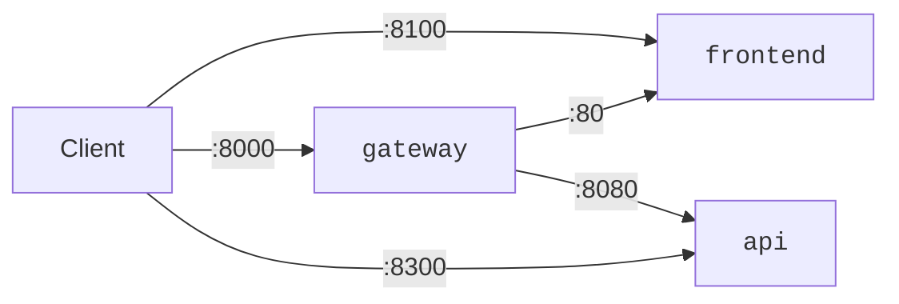
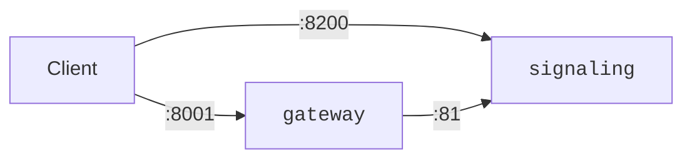

# Planning Poker


A WebRTC-based, stateless planning poker game. The application consists out of several modules.

## Modules

- `modules/api`: The API application module.
- `modules/frontend`: The frontend application module.
- `modules/gateway`: The gateway application module.
- `modules/signaling`: A WebSocket signaling service.

## Requirements

- Local Container Platform including a "Compose" (_Podman_ with `podman-compose`, _Docker Desktop_).

## Usage

### Build Modules

Build all application module container images (including their versions) as described in

- [modules/api/README.md](modules/api/README.md)
- [modules/frontend/README.md](modules/frontend/README.md)
- [modules/gateway/README.md](modules/gateway/README.md)
- [modules/signaling/README.md](modules/signaling/README.md)

or use the script

```
./bin/build_image.sh
```

which helps with building each module.

```
Usage: build.sh MODULE VERSION

Where:
    MODULE    : One of
                    api
                    frontend
                    signaling
                    gateway
    VERSION   : The version tag.
```

The module name is prefixed with the string `planning-poker-`. Thus, building creates the image 
`planning-poker-MODULE:VERSION` in the local registry.

Or run `build.sh all VERSION` to build all module images and tag them accordingly.

### Run

Run

```shell
podman compose up
```

in the project base directory.

**Please note:**

- Add `-d` to run containers in background.
- Add `--force-recreate` to always recreate containers.

## Network Configuration

All modules are supposed to be served as container. This section provides an overview over the network configuration
used by default:

| Service     | Hostname    | Port (External) | Port (Internal) | Target                             |
|-------------|-------------|-----------------|-----------------|------------------------------------|
| `gateway`   | `gateway`   | `8000`          | `80`            | Upstream services, e.g. `frontend` |
|             |             | `8001`          | `81`            | Websocket                          |
| `frontend`  | `frontend`  | `8100`          | `80`            | Page                               | 
| `signaling` | `signaling` | `8200`          | `8080`          | WebSocket                          |
| `api`       | `api`       | `8300`          | `8080`          | HTTP REST API Service.             |

**Please note:** At the moment it is not possible for the gateway to proxy the signaling service behind the same port as
the other services. The signaling service is a TCP service which is handled _before_ HTTP which effectively disables the
HTTP route to the frontend.

### Overview: HTTP



### Overview: WebSocket (TCP)


